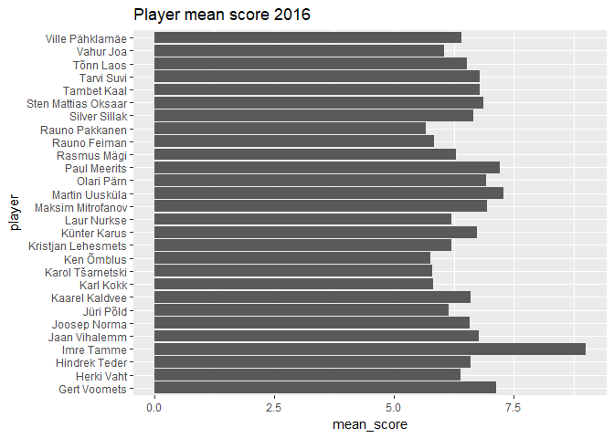
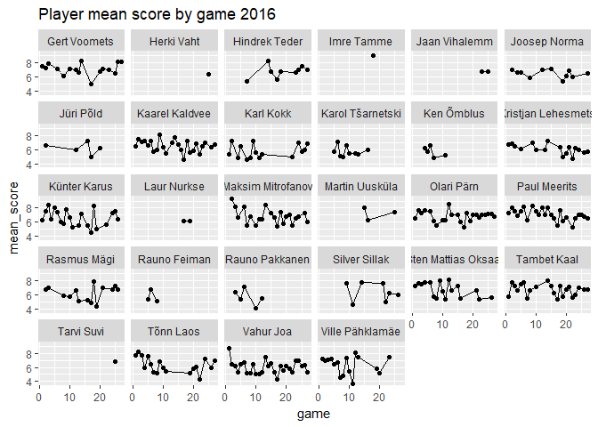

Fauna season 2016
================
Hindrek Teder
October 21, 2017

Libraries
---------

``` r
library(tidyverse)
```

    ## Loading tidyverse: ggplot2
    ## Loading tidyverse: tibble
    ## Loading tidyverse: tidyr
    ## Loading tidyverse: readr
    ## Loading tidyverse: purrr
    ## Loading tidyverse: dplyr

    ## Warning: package 'ggplot2' was built under R version 3.4.2

    ## Warning: package 'tibble' was built under R version 3.4.2

    ## Warning: package 'tidyr' was built under R version 3.4.2

    ## Warning: package 'readr' was built under R version 3.4.2

    ## Warning: package 'purrr' was built under R version 3.4.2

    ## Warning: package 'dplyr' was built under R version 3.4.2

    ## Conflicts with tidy packages ----------------------------------------------

    ## filter(): dplyr, stats
    ## lag():    dplyr, stats

``` r
library(readxl)
library(stringr)
```

Data transformation
-------------------

``` r
clean <- function(df) {
  df %>%
    filter(!is.na(`Vastaja nimi`)) %>%
    select(-Timestamp, -`Vastaja nimi`) %>%
    gather(key = "player", value = "score") %>%
    mutate(player = str_sub(player, start = 12, end = -2)) %>%
    mutate(player = str_replace(player, pattern = "\\(.*\\)", replacement = "")) %>%
    mutate(player = str_trim(player))
}

path <- "scores2016.xlsx"
sheets <- rev(excel_sheets(path))  # order chronologically
df <- data_frame()
for(i in 1:length(sheets)) {
  tmp <- read_xlsx(path, sheets[i]) %>%
    clean() %>%
    mutate(game = i)  # add game
  df <- bind_rows(df, tmp)
}
```

Descriptive analysis
--------------------

``` r
season_summary <- df %>%
  group_by(player) %>%
  summarise(mean_score = mean(score, na.rm = T)) %>%
  arrange(desc(mean_score))
season_summary
```

    ## # A tibble: 28 x 2
    ##                 player mean_score
    ##                  <chr>      <dbl>
    ##  1          Imre Tamme   9.000000
    ##  2      Martin Uusküla   7.285714
    ##  3        Paul Meerits   7.213018
    ##  4        Gert Voomets   7.137255
    ##  5   Maksim Mitrofanov   6.946154
    ##  6          Olari Pärn   6.920245
    ##  7 Sten Mattias Oksaar   6.865079
    ##  8          Tarvi Suvi   6.800000
    ##  9         Tambet Kaal   6.794326
    ## 10       Jaan Vihalemm   6.777778
    ## # ... with 18 more rows

``` r
game_summary <- df %>%
  group_by(player, game) %>%
  summarise(mean_score = mean(score, na.rm = T))
game_summary
```

    ## # A tibble: 343 x 3
    ## # Groups:   player [?]
    ##          player  game mean_score
    ##           <chr> <int>      <dbl>
    ##  1 Gert Voomets     1   7.555556
    ##  2 Gert Voomets     2   7.222222
    ##  3 Gert Voomets     3   7.857143
    ##  4 Gert Voomets     6   7.111111
    ##  5 Gert Voomets     8   6.200000
    ##  6 Gert Voomets    10   7.111111
    ##  7 Gert Voomets    12   7.000000
    ##  8 Gert Voomets    13   6.600000
    ##  9 Gert Voomets    14   8.250000
    ## 10 Gert Voomets    17   5.000000
    ## # ... with 333 more rows

Data visualisation
------------------

``` r
ggplot(season_summary, aes(x = player, y = mean_score)) +
  geom_col() +
  coord_flip() +
  ggtitle("Player mean score 2016")
```



``` r
ggplot(game_summary, aes(x = game, y = mean_score)) +
  geom_point() +
  geom_line() +
  facet_wrap(facets = "player") +
  ggtitle("Player mean score by game 2016")
```

    ## geom_path: Each group consists of only one observation. Do you need to
    ## adjust the group aesthetic?
    ## geom_path: Each group consists of only one observation. Do you need to
    ## adjust the group aesthetic?
    ## geom_path: Each group consists of only one observation. Do you need to
    ## adjust the group aesthetic?


