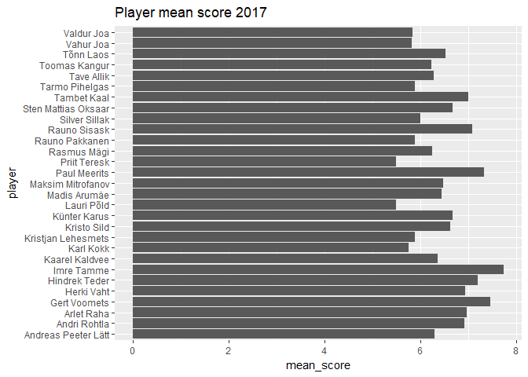
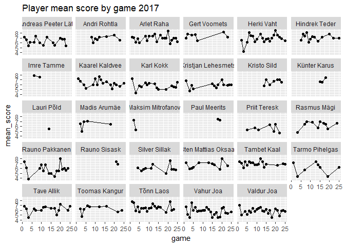

Fauna season 2017
================
Hindrek Teder
October 21, 2017

Libraries
---------

``` r
library(tidyverse)
```

    ## Loading tidyverse: ggplot2
    ## Loading tidyverse: tibble
    ## Loading tidyverse: tidyr
    ## Loading tidyverse: readr
    ## Loading tidyverse: purrr
    ## Loading tidyverse: dplyr

    ## Warning: package 'ggplot2' was built under R version 3.4.2

    ## Warning: package 'tibble' was built under R version 3.4.2

    ## Warning: package 'tidyr' was built under R version 3.4.2

    ## Warning: package 'readr' was built under R version 3.4.2

    ## Warning: package 'purrr' was built under R version 3.4.2

    ## Warning: package 'dplyr' was built under R version 3.4.2

    ## Conflicts with tidy packages ----------------------------------------------

    ## filter(): dplyr, stats
    ## lag():    dplyr, stats

``` r
library(readxl)
library(stringr)
```

Data transformation
-------------------

``` r
clean <- function(df) {
  df %>%
    filter(!is.na(`Vastaja nimi`)) %>%
    select(-Timestamp, -`Vastaja nimi`) %>%
    gather(key = "player", value = "score") %>%
    mutate(player = str_sub(player, start = 12, end = -2)) %>%
    mutate(player = str_replace(player, pattern = "\\(.*\\)", replacement = "")) %>%
    mutate(player = str_trim(player))
}

path <- "scores2017.xlsx"
sheets <- rev(excel_sheets(path))  # order chronologically
df <- data_frame()
for(i in 1:length(sheets)) {
  tmp <- read_xlsx(path, sheets[i]) %>%
    clean() %>%
    mutate(game = i)  # add game
  df <- bind_rows(df, tmp)
}
```

Descriptive analysis
--------------------

``` r
season_summary <- df %>%
  group_by(player) %>%
  summarise(mean_score = mean(score, na.rm = T)) %>%
  arrange(desc(mean_score))
season_summary
```

    ## # A tibble: 29 x 2
    ##           player mean_score
    ##            <chr>      <dbl>
    ##  1    Imre Tamme   7.733333
    ##  2  Gert Voomets   7.466667
    ##  3  Paul Meerits   7.333333
    ##  4 Hindrek Teder   7.197368
    ##  5  Rauno Sisask   7.090909
    ##  6   Tambet Kaal   7.008621
    ##  7    Arlet Raha   6.975207
    ##  8    Herki Vaht   6.932836
    ##  9  Andri Rohtla   6.925926
    ## 10  Künter Karus   6.666667
    ## # ... with 19 more rows

``` r
game_summary <- df %>%
  group_by(player, game) %>%
  summarise(mean_score = mean(score, na.rm = T))
game_summary
```

    ## # A tibble: 327 x 3
    ## # Groups:   player [?]
    ##                 player  game mean_score
    ##                  <chr> <int>      <dbl>
    ##  1 Andreas Peeter Lätt     1   7.200000
    ##  2 Andreas Peeter Lätt     2   6.700000
    ##  3 Andreas Peeter Lätt     3   5.428571
    ##  4 Andreas Peeter Lätt     4   6.125000
    ##  5 Andreas Peeter Lätt     6   6.142857
    ##  6 Andreas Peeter Lätt     7   7.400000
    ##  7 Andreas Peeter Lätt     9   6.000000
    ##  8 Andreas Peeter Lätt    11   5.500000
    ##  9 Andreas Peeter Lätt    13   7.200000
    ## 10 Andreas Peeter Lätt    16   6.000000
    ## # ... with 317 more rows

Data visualisation
------------------

``` r
ggplot(season_summary, aes(x = player, y = mean_score)) +
  geom_col() +
  coord_flip() +
  ggtitle("Player mean score 2017")
```



``` r
ggplot(game_summary, aes(x = game, y = mean_score)) +
  geom_point() +
  geom_line() +
  facet_wrap(facets = "player") +
  ggtitle("Player mean score by game 2017")
```

    ## geom_path: Each group consists of only one observation. Do you need to
    ## adjust the group aesthetic?


